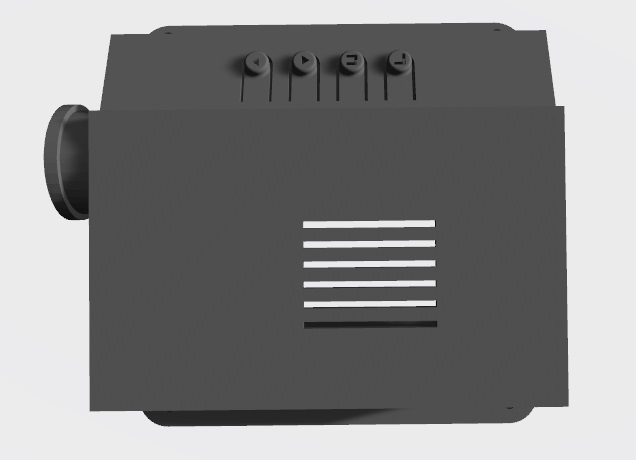

# Cyberpunk Mask    
一个基于ESP32的赛博朋克面具，通过右上角的菜单和按钮选择左下角屏幕显示的动画，以及控制跑马灯的灯效。

        

## 文件说明        
- CyberpunkMaskEsp32    
  基于Arduino的ESP-WAROOM-32代码，Boards Manager请安装esp32插件。

- MaskParts     
  solidworks模型文件
  - stl     
    STL格式的模型文件

## 开发环境        
- Arduino IDE [1.8.19]      
- Board: esp32 [2.0.2]
  - DOIT ESP32 DEVKIT V1    
  - Upload speed: 921600 (Default)
  - Flash frequency: 80MHz (Default)
- Libraries:        
  - ESP32 Digital RGB LED Drivers [76863da42599f7b082821e4cee0ea00ba23b0918] | https://github.com/MartyMacGyver/ESP32-Digital-RGB-LED-Drivers | WS2812跑马灯带 (安装库的非本次使用的版本，已复制到本项目代码中)      
  - ESP8266 and ESP32 OLED driver for SSD1306 displays [4.3.0]| https://github.com/ThingPulse/esp8266-oled-ssd1306 | SSD1306 OLED I2C屏幕       
  - Time [1.6.1] | Arduino 时间库      
 

## 电路图
本次使用的是Goouuu-ESP32，引脚定义如下，可以根据实际芯片的端口调整接线，具体请调整代码中的I/O定义。      

## 装配
### 3D打印的零件(TPU打印材料 ￥64/kg)        
- 菜单显示屏固定架(part_menu_frame)：      

- 图形显示屏固定架(part_screen_frame)：      

- 中间连接器(part_connector)：      

- 主板固定架(part_board_cage)：      

### 购买的零件
- 面具（￥25）      

- OLED透明显示屏1.51寸 128*64（SSD1306 ￥56）×2       

- WS2812B LED灯带 60灯（￥17/m）        

- ESP32 ESP-WROOM-32（Goouuu-ESP32 ￥21）     

- PE波纹管（AD10:￥5/5m,AD21.2：￥5.8/5m）     

- 灯带硅胶外壳（D13*13 ￥10/m）          

- 导线若干

### 成品      

## 效果

